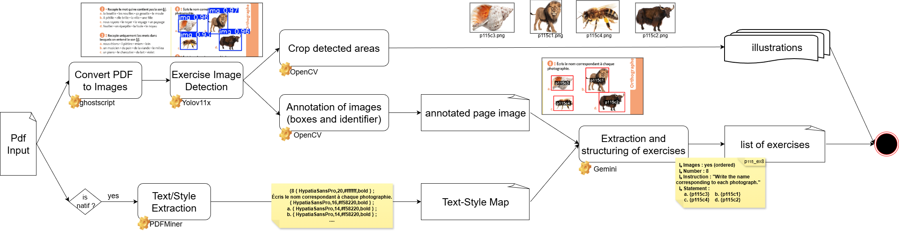

# extractionPipeline-TxtStyle

Version mise à jour du pipeline d'extraction MALIN avec **extraction texte + style** pour PDF natifs et **classification automatique**.

<p align="center">

</p>

## Vue d’ensemble

Pipeline complet d’extraction et de classification d’exercices à partir de PDF scolaires :

* **Ghostscript** — Conversion PDF → images
* **YOLOv11x** — Détection des exercices / illustrations
* **OpenCV** — Annotation (dessin des boîtes) et découpe (crops)
* **PyMuPDF / PDFMiner** — Extraction du texte et du style (gras, couleur, etc.)
* **Gemini Vision (2.5 Flash)** — Structuration des exercices (Enoncé, Consigne, Conseils, etc.)
* **Traitement de texte** — Nettoyage automatique des caractères spéciaux (THSB, NNBSP)
* **CamemBERT** — Classification des exercices par typologie (Associe, QCM, Vrai/Faux...)
* **Post-processing** — Rangement automatique des sorties par catégorie.

## Pourquoi ajouter le style ?

Certains exercices utilisent des **mots stylés** (couleur, gras, italique…) au sein d’un bloc de texte au style uniforme.
Pour les distinguer correctement, nous avons ajouté une étape **Text/Style Map**.

En ajoutant cette étape, on a constaté que **l’extraction globale s’améliore nettement**.

---

## Pré-requis

**1. Environnement Python (3.9 recommandé)**

```bash
python-3.9.13-amd64.exe /quiet InstallAllUsers=1 PrependPath=1 Include_test=0
py -3.9 -m venv venv39
venv39\Scripts\activate
pip install -r requirements.txt

```

**2. Dépendances externes & Modèles**

* **Ghostscript** installé sur la machine (nécessaire pour PDF → images).
* **Clé API Gemini** → Créer un fichier `apikey.txt` à la racine contenant uniquement la clé.
* **Poids YOLOv11x** (`.pt`) → À placer dans `models/detImages/`. [Lien de téléchargement]().
* **Dossier source** → Créer un dossier `PdfSource/` à la racine et y glisser vos fichiers PDF.

---

## Utilisation (Ligne de commande)

Le pipeline se lance désormais entièrement via des arguments en ligne de commande depuis `main.py`. Plus besoin de modifier le code source pour changer de page !

### Syntaxe générale :

```bash
python main.py <nom_du_pdf.pdf> [--all] [--first N] [--last N] [--style true/false]
python main.py MagnardCE22025.pdf --first 7 --last 7

```

### Exemples :

**1. Tester sur quelques pages (ex: pages 9 à 10) sans style :**

```bash
python main.py manual_CE1_FRANCAIS_MAGNARD.pdf --first 9 --last 10

```

**2. Tester sur quelques pages AVEC l'extraction du style (Gras, couleurs) :**

```bash
python main.py manual_CE1_FRANCAIS_MAGNARD.pdf --first 9 --last 10 --style true

```

**3. Lancer sur TOUT le PDF :**

```bash
python main.py manual_CE1_FRANCAIS_MAGNARD.pdf --all

```

---

## Sorties & Arborescence

À la fin de l'exécution, un dossier **`OUTPUTS/<nom_du_pdf>/`** est généré automatiquement. Il est structuré de manière optimale pour une utilisation directe :

```text
OUTPUTS/manual_CE1_FRANCAIS_MAGNARD.pdf/
├── Extraction/                 # Un fichier .json par page contenant tous les exercices
│   ├── page_9.json
│   └── page_10.json
├── Images/                     # Les crops (découpes) des illustrations détectées par YOLO
│   ├── page_9_c0.png
│   └── ...
└── Classification/             # Exercices séparés 1 par 1 et triés dans des dossiers par type
    ├── ClasseCM/
    │   └── p10_ex1.json
    ├── CochePhrase/
    │   └── p10_cherchons.json
    ├── EditPhrase/
    │   └── p9_ex4.json
    └── ...

```

---

## Formats JSON (Style vs Sans Style)

Possibilité d'avoir **deux formats JSON** de sortie (via le paramètre `--style`) :

### 1. JSON **avec style** (`--style true`)

* Préserve la mise en forme LaTeX : `\bf{}`, `\it{}`, `\color{"txt",#HEX}`
* Références images : `\image{id}`
* Utilisé quand la mise en forme (ex: mots en gras à identifier) contient une information importante.

### 2. JSON **sans style** (`--style false` par défaut)

* Texte simplifié, brut, sans balises de formatage.
* Images référencées avec `\image{id}`.
* Préféré pour les traitements simples où le style visuel n'a pas d'impact sur la consigne.

---

## Schéma JSON

```json
{
  "$defs": {
    "Exercise": {
      "properties": {
        "id": {
          "anyOf": [{ "type": "string" }, { "type": "null" }],
          "default": null
        },
        "type": {
          "const": "exercise",
          "type": "string",
          "default": "exercise"
        },
        "images": {
          "type": "boolean",
          "default": false
        },
        "image_type": {
          "type": "string",
          "enum": ["none", "single", "ordered", "unordered", "composite"],
          "default": "none"
        },
        "properties": {
          "$ref": "#/$defs/Properties",
          "default": {
            "number": null,
            "instruction": null,
            "labels": [],
            "statement": null,
            "hint": null,
            "example": null,
            "references": null
          }
        }
      },
      "type": "object"
    },
    "Properties": {
      "properties": {
        "number": {
          "anyOf": [{ "type": "string" }, { "type": "null" }],
          "default": null
        },
        "instruction": {
          "anyOf": [{ "type": "string" }, { "type": "null" }],
          "default": null
        },
        "labels": {
          "type": "array",
          "items": { "type": "string" },
          "default": []
        },
        "statement": {
          "anyOf": [{ "type": "string" }, { "type": "null" }],
          "default": null
        },
        "hint": {
          "anyOf": [{ "type": "string" }, { "type": "null" }],
          "default": null
        },
        "example": {
          "anyOf": [{ "type": "string" }, { "type": "null" }],
          "default": null
        },
        "references": {
          "anyOf": [{ "type": "string" }, { "type": "null" }],
          "default": null
        }
      },
      "type": "object"
    }
  },
  "items": { "$ref": "#/$defs/Exercise" },
  "type": "array"
}

